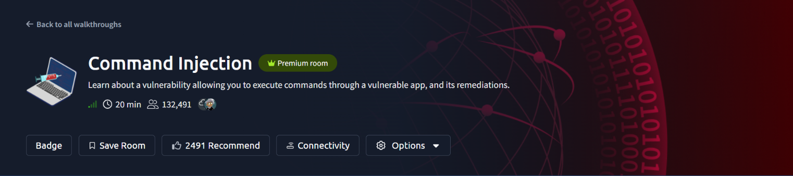
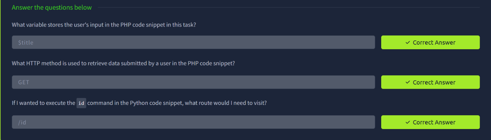
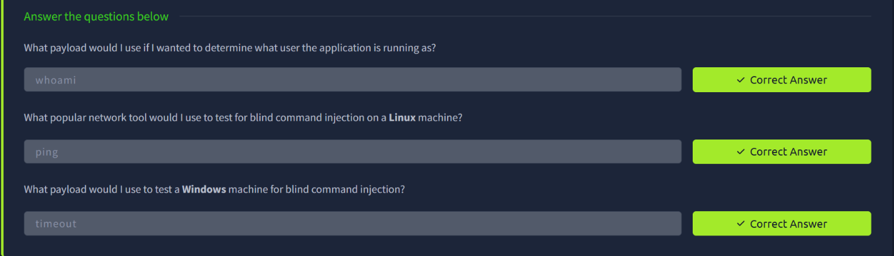
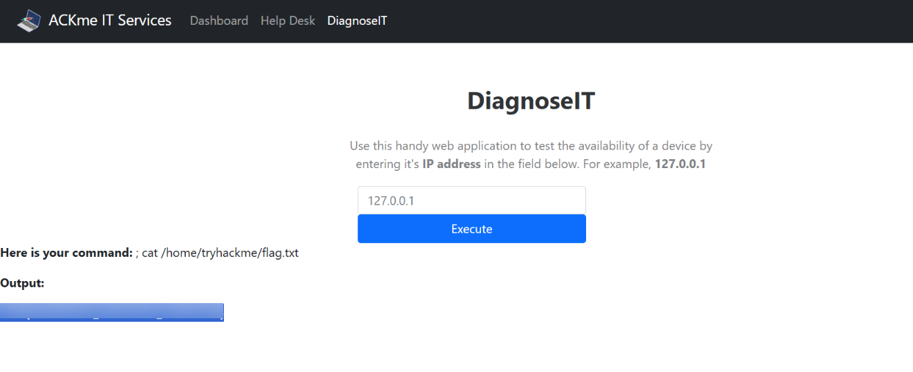
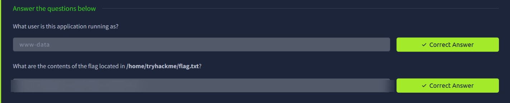
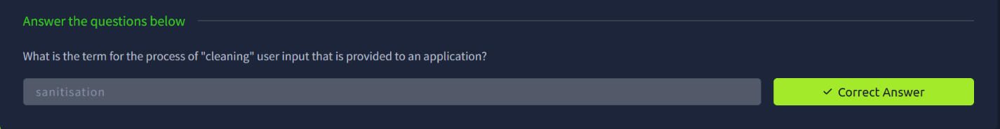

# TryHackMe — Command Injection

> **Track:** Cyber Security 101 → Web Hacking
> **Difficulty:** Easy · **Time:** ~20 min
> **Focus:** Identifying and exploiting OS command injection in a vulnerable web app, including blind detection techniques



Command injection happens when an application passes user-controlled input straight into a system shell call. If that input isn't sanitised, an attacker can chain in their own commands alongside — or instead of — the intended one. This room covers both the code-level mechanics and the live exploitation of a real vulnerable app, **DiagnoseIT**.

---

## Table of Contents
1. [How the Vulnerable Code Takes Input](#1-how-the-vulnerable-code-takes-input)
2. [Payloads for Visible Output](#2-payloads-for-visible-output)
3. [Blind Command Injection Payloads](#3-blind-command-injection-payloads)
4. [Exploiting DiagnoseIT](#4-exploiting-diagnoseit)
5. [Reading the Flag](#5-reading-the-flag)
6. [Remediation: Sanitisation](#6-remediation-sanitisation)
7. [Key Takeaways](#7-key-takeaways)

---

## 1. How the Vulnerable Code Takes Input

The room first walks through the vulnerable source code itself, in both PHP and Python examples.

- In the **PHP** snippet, user input is stored in the **`$title`** variable, and it's pulled from the request using the **`GET`** HTTP method — meaning the payload travels straight in the URL's query string.
- In the **Python** snippet, the same idea applies via routing: to execute the `id` command, you'd visit the **`/id`** route directly, since the route itself becomes the command that gets executed.

```php
<?php
$title = $_GET['title'];
system("some_command " . $title);
?>
```



**Why it matters:** the vulnerability exists the moment unsanitised user input reaches a system call function (`system()`, `exec()`, `os.system()`, etc.) — the specific language or framework is incidental.

---

## 2. Payloads for Visible Output

The simplest first payload to confirm command injection — and gather useful recon — is:

```bash
whoami
```

This reveals what user context the vulnerable application is running as, which matters for scoping what you can reach next (file permissions, further privilege escalation, etc.).

---

## 3. Blind Command Injection Payloads

Not every injection point echoes command output back to you. When the response gives no visible feedback, **blind command injection** techniques confirm execution indirectly, usually via timing:

- On **Linux**: `ping` — sending a specific number of ICMP packets (`ping -c 10 <your IP>` or similar) creates a measurable delay you can observe, confirming the command ran even with no visible output.
- On **Windows**: `timeout` — pauses execution for a set number of seconds, serving the same timing-based confirmation role as `ping` does on Linux.



---

## 4. Exploiting DiagnoseIT

With the theory covered, the room moves to a live target: **DiagnoseIT**, an internal "ACKme IT Services" tool that lets a user test whether a device is reachable by entering its IP address.



The app's own example input (`127.0.0.1`) is a strong hint it's running a ping command server-side against whatever is typed in. Chaining a second command onto that input with a command separator (`;`) lets an attacker's command ride along after the intended ping:

```
127.0.0.1 ; cat /home/tryhackme/flag.txt
```

Submitting this confirms the application runs as **`www-data`**, the standard low-privilege web server user on Linux systems — consistent with a typical Apache/Nginx + PHP deployment.



---

## 5. Reading the Flag

The payload above successfully chains a `cat` of the flag file onto the legitimate ping command. DiagnoseIT echoes both the constructed command and its output back on the page, confirming the injection worked end-to-end.


> Flag redacted — the technique (`;` command separator → `cat` the target file) is what matters.

---

## 6. Remediation: Sanitisation

The room closes on the fix. The general term for "cleaning" user input before an application acts on it is **sanitisation** — validating, filtering, or escaping input so that control characters like `;`, `&&`, `|`, and backticks can't be used to inject additional commands.



In practice, proper remediation goes beyond simple character blacklisting: using safe APIs that never invoke a shell (e.g. passing arguments as a list rather than a concatenated string), strict input allowlisting (e.g. only accepting valid IPv4 patterns here), and running the process with the least privilege necessary.

---

## 7. Key Takeaways

- **Any user input that reaches a shell call is a potential injection point**, regardless of the language — PHP's `system()` and Python's `os.system()`/routing both show the same underlying flaw.
- **Command separators (`;`, `&&`, `||`, `|`, backticks)** are the core technique for chaining an extra command onto a legitimate one.
- **Blind injection still confirms the bug** — timing-based payloads (`ping` on Linux, `timeout` on Windows) work even with zero visible output.
- **The running user matters.** Finding the app runs as `www-data` immediately tells you what you've gained (a low-privilege foothold) and what comes next (privilege escalation).
- **Sanitisation is the fix**, but the strongest version of it avoids shell invocation entirely rather than trying to blacklist dangerous characters.

---

*Room completed on 4 October 2026 as part of the Cyber Security 101 path.*
